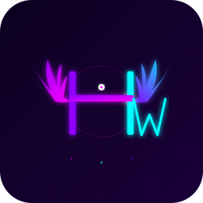

<p align="center">
  
</p>

<h1 align="center">Hermes Wingman</h1>

<p align="center">
  <strong>The definitive GUI for <a href="https://hermes-agent.nousresearch.com">Hermes Agent</a></strong>
  <br>
  Three ways to control your AI agent — desktop app, mobile app, and web dashboard
</p>

<p align="center">
  
  
  
  
  
  
</p>

---

## 📋 Overview

Hermes Wingman replaces the entire Hermes CLI with a beautiful, full-featured GUI — no terminal needed. It comes in three flavors that work together or independently:

| Edition | Stack | Use Case |
|---------|-------|----------|
| **Desktop App** | Flutter + Rust backend | Power users, full control, system tray |
| **Mobile App** | Flutter (Android/iOS) | Remote control from anywhere on your LAN |
| **Web Dashboard** | Ruby on Rails 8 + Hotwire + Tailwind | Browser-based access, multi-user, cloud deployment |

**Hermes Wingman handles everything `hermes setup` does — and more:**
- Install & configure Hermes Agent
- Add API providers (OpenAI, Anthropic, xAI, Google, etc.)
- Login via OAuth (Nous, xAI)
- Switch models and probe provider connections
- Manage skills, memory, cron jobs, and gateway platforms
- Edit config.yaml with a live YAML editor
- Browse and edit workspace files
- Schedule autonomous AI missions
- Save and apply model presets

---

## 🏗️ Architecture

```
┌──────────────────────────────────────────────────────────────┐
│                        Your Network                           │
│                                                              │
│  ┌─────────────────────┐    HTTP API     ┌────────────────┐  │
│  │  Flutter Desktop     │ ◄─────────────►  │  Rust Backend  │  │
│  │  (Linux/macOS/Win)  │    port 9120     │  (Axum server)  │  │
│  └─────────────────────┘                  └────────┬───────┘  │
│                                                    │         │
│  ┌─────────────────────┐                          │         │
│  │  Flutter Mobile      │ ◄──── HTTP over LAN ────┘         │
│  │  (Android/iOS)      │                                    │
│  └─────────────────────┘                                    │
│                                                    │         │
│  ┌─────────────────────┐    HTTP API              │         │
│  │  Rails Web App      │ ◄───────────────►        │         │
│  │  (port 3000)        │   proxies to :9120       │         │
│  └─────────────────────┘                          │         │
│                                                    ▼         │
│                                         ┌──────────────────┐ │
│                                         │  Hermes Agent CLI │ │
│                                         │  (OAuth, fallback)│ │
│                                         └──────────────────┘ │
└──────────────────────────────────────────────────────────────┘
```

### How It Works

1. **Rust Backend** runs on a desktop/server and exposes a REST API on port 9120. It auto-binds to `0.0.0.0` so any device on your LAN can connect.
2. **Flutter Desktop App** talks to the backend via localhost. Full system tray integration with minimize-to-tray.
3. **Flutter Mobile App** auto-discovers the backend on your LAN (no manual IP entry). Scans the subnet for port 9120.
4. **Rails Web Dashboard** proxies through the Rust backend, giving you browser-based access from any device.
5. The backend makes **direct API calls** to providers (OpenAI, Anthropic, llama-swap) for fast streaming responses, or shells out to the **Hermes CLI** for OAuth-based providers (Nous, xAI).

---

## 🚀 Getting Started

### Option 1: Desktop App (Recommended)

```bash
# 1. Download the latest release for your platform
# 2. Run it — the app auto-starts the Rust backend
# 3. Open Hermes Wingman → Setup → Follow the 3-step wizard
```

The setup wizard handles everything:
1. **Install Hermes Agent** (if not already installed)
2. **Add a provider** — pick OpenAI, Anthropic, xAI, or login via OAuth
3. **Pick your default model** — and you're done. No CLI needed.

### Option 2: Web Dashboard

```bash
cd hermes_wingman_web

# Install dependencies
bundle install

# Start the server
bin/rails server -b 0.0.0.0 -p 3000

# Open http://localhost:3000 in your browser
```

The web app connects to the Rust backend at `http://127.0.0.1:9120`. Set `HERMES_BACKEND_URL` env var to change this.

### Option 3: Mobile App

1. Install the APK from the [Releases page](https://github.com/synthalorian/hermes-wingman/releases)
2. Open the app — it auto-scans your LAN for the desktop backend
3. If auto-discovery fails, go to **Config → Backend Connection** and enter your desktop's IP

### Prerequisites

- **Hermes Agent** installed (the setup wizard handles this)
- For local models: **llama-swap** running on port 8080
- For the web app: **Ruby 4.0+**, **Rails 8.1+**, **SQLite3**

---

## 🔧 Configuration

### From the GUI (no CLI needed)

| Feature | Where | How |
|---------|-------|-----|
| Add API provider | **Setup** or **Config → Providers** → Add | Enter name, API key, base URL, model |
| OAuth login | **Setup** → pick Nous/xAI | Runs `hermes login nous` in the backend |
| Switch model | **Models** tab | Click any model to switch immediately |
| Probe providers | **Models** tab → Probe button | Tests each provider's connection |
| Edit config.yaml | **Config** tab | Full syntax-highlighted YAML editor |
| Manage skills | **Skills** tab | Toggle skills on/off, search by name |
| Manage memory | **Memory** tab | View, search, delete memory entries |
| Browse files | **Files** tab | Read/edit files in `~/.hermes` workspace |
| Cron jobs | **Cron** tab | Schedule recurring AI tasks |
| Gateway | **Gateway** tab | Connect Discord, Telegram, Signal, etc. |
| Missions | **Missions** tab | Define and run autonomous agent missions |
| Profiles | **Profiles** tab | Save/load model + config presets |
| Setup wizard | **Setup** tab | Step-by-step Hermes setup (replaces `hermes setup`) |

### Environment Variables

| Variable | Purpose |
|----------|---------|
| `BIND_ADDR` | Backend bind address (default: `127.0.0.1:9120`, set to `0.0.0.0:9120` for LAN) |
| `HERMES_BACKEND_URL` | Rails webapp backend URL (default: `http://127.0.0.1:9120`) |
| `HERMES_TIMEOUT` | Backend request timeout in seconds (default: `10`) |

---

## 🎨 Themes

Hermes Wingman ships with **29 hand-crafted themes** — including 20 Greek god pantheon themes:

**Retro:** Synthwave '84, Synthwave Light, Outrun, Vaporwave, Cyberpunk
**Brand:** Hermes (FLAGSHIP — deep teal + celestial gold)
**Pantheon:** Zeus, Hera, Poseidon, Hades, Ares, Apollo, Artemis, Athena, Aphrodite, Dionysus, Demeter, Hephaestus, Hestia, Nyx, Eos, Hypnos, Iris, Tyche, Thanatos, Nemesis, Hecate
**Standard:** Light, Dark

Every theme syncs across all three platforms — desktop, mobile, and web. Switch anytime from the sidebar palette icon.

---

## 📱 Cross-Platform Features

| Feature | Desktop | Mobile | Web |
|---------|---------|--------|-----|
| Chat with streaming | ✅ | ✅ | ✅ |
| Model switching | ✅ | ✅ | ✅ |
| Provider management | ✅ | ✅ | ✅ |
| Config editor | ✅ | ✅ | ✅ |
| Skills browser | ✅ | ✅ | ✅ |
| Memory viewer | ✅ | ✅ | ✅ |
| File explorer | ✅ | ✅ | ✅ |
| Cron manager | ✅ | ✅ | ✅ |
| Gateway dashboard | ✅ | ✅ | ✅ |
| Session manager | ✅ | ✅ | ✅ |
| Live logs | ✅ | ✅ | ✅ |
| Mission conductor | ✅ | ✅ | ✅ |
| Profiles | ✅ | ✅ | ✅ |
| Webhooks | — | — | ✅ |
| Usage analytics | — | — | ✅ |
| Setup wizard | ✅ | ✅ | — |
| System tray | ✅ | — | — |
| LAN auto-discovery | — | ✅ | — |
| 29 themes | ✅ | ✅ | ✅ |
| Glass morphism UI | ✅ | ✅ | ✅ |
| Animated starfield | ✅ | — | ✅ |

---

## 🛠️ Building from Source

### Full Stack

```bash
git clone https://github.com/synthalorian/hermes-wingman.git
cd hermes-wingman

# Rust backend
cd backend && cargo build --release && cd ..

# Flutter desktop
flutter build linux --release

# Flutter mobile
flutter build apk --debug

# Rails web app
cd ../hermes_wingman_web
bundle install
bin/rails tailwindcss:build
bin/rails server -b 0.0.0.0 -p 3000
```

### Android Build Notes

The Android build requires JDK 21+. Set `JAVA_HOME` if needed:
```bash
export JAVA_HOME=/usr/lib/jvm/java-21-openjdk
flutter build apk --release
```

### iOS Build Notes

iOS builds require macOS with Xcode 16+, an Apple Developer account, and CocoaPods:
```bash
cd ios && pod install && cd ..
flutter build ios --release
```

---

## 📁 Project Structure

```
hermes_wingman/                    # Flutter + Rust monorepo
├── lib/                           # Flutter Dart source
│   ├── main.dart                  # App entry, splash screen, shell
│   ├── theme/                     # Theme system, glass cards, animations
│   ├── screens/                   # 15 screens (dashboard, chat, models, etc.)
│   ├── services/                  # BackendService, HermesClient, ChatManager
│   ├── models/                    # Hermes data models
│   └── widgets/                   # WingmanIcon, reusable components
├── backend/                       # Rust Axum server
│   └── src/main.rs                # 2,350+ line backend with 40+ API endpoints
├── android/                       # Android platform files
├── ios/                           # iOS platform files
├── linux/                         # Linux platform files
├── macos/                         # macOS platform files
├── windows/                       # Windows platform files
└── assets/                        # Icons, images

hermes_wingman_web/                # Ruby on Rails 8 web dashboard
├── app/
│   ├── controllers/               # 24 controllers (RESTful + Turbo)
│   ├── views/                     # 22 view directories + layouts
│   ├── services/                  # HermesApiService (proxies to Rust backend)
│   ├── models/                    # Profile, Mission, Webhook, etc.
│   └── assets/tailwind/           # 30-theme CSS system with glass effects
├── config/routes.rb               # All routes defined
└── db/migrate/                    # SQLite schema
```

---

## 🌐 Web Dashboard Details

The Rails web app mirrors the Flutter app's functionality in the browser:

**Tech stack:** Ruby on Rails 8.1 + Hotwire/Turbo + Tailwind CSS v4 + SQLite
**Port:** 3000 (configurable)
**Themes:** Same 30-theme CSS custom property system as the Flutter app
**Backend:** Proxies all requests to the Rust backend at port 9120

All 24 controllers map to features in the Flutter desktop app:
`DashboardController`, `ChatController`, `ModelsController`, `SessionsController`,
`SkillsController`, `MemoryController`, `FilesController`, `ConfigController`,
`LogsController`, `CronController`, `GatewayController`, `SetupController`,
`ToolsController`, `InspectorController`, `MissionsController`,
`OrchestrationController`, `ProfilesController`, `WebhooksController`,
`UsageController`, `ThemeController`, `ProvidersController`, `ApiController`,
`HermesController`

---

## 🤝 Contributing

See [CONTRIBUTING.md](CONTRIBUTING.md) for the full guide.

1. Fork the repository
2. Create a feature branch (`git checkout -b feature/amazing`)
3. Keep `dart analyze` clean (zero errors)
4. Keep `flutter build` and `cargo build` passing
5. Open a Pull Request

### Development Quick Start

```bash
# Clone
git clone https://github.com/synthalorian/hermes-wingman.git
cd hermes-wingman

# Start the Rust backend
BIND_ADDR=0.0.0.0:9120 backend/target/release/hermes-wingman-backend &

# Run Flutter in debug mode
flutter run

# Or run the Rails web app
cd ../hermes_wingman_web && bin/rails server
```

---

## ☕ Support Development

If Hermes Wingman helps you work faster, smoother, or cooler — consider buying me a coffee!

<p align="center">
  <a href="https://buymeacoffee.com/synthalorian">
    
  </a>
</p>

---

## 📄 License

MIT License — see [LICENSE](LICENSE) for details.

Made by [synthalorian](https://github.com/synthalorian) with [synthshark](https://github.com/synthalorian) — a digital entity from the neon grid of 1984.

*This is the wave. 🎹🦈🌆*
